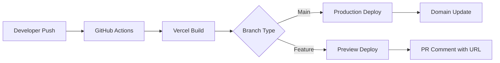

# 🚀 **VERCEL PRO DEPLOYMENT - 3ASYAPP TEMPLATE**

**Production-Grade Deployment Pipeline for Professional Applications**

*Complete Vercel deployment guide optimized for professional developers*

---

## 🎯 **Vercel PRO Overview**

**Vercel** is the **only recommended deployment platform** for the 3ASYAPP template. It provides:

- **⚡ Global CDN**: 300+ edge locations worldwide
- **🔧 PRO Features**: Advanced security, analytics, monitoring
- **📊 Performance**: Sub-second load times, high availability
- **🔄 CI/CD**: Git-integrated deployment automation
- **🛡️ Security**: Professional-grade security features
- **📈 Analytics**: Real-time performance and user analytics

---

## 📋 **Professional Pre-Deployment Checklist**

### **✅ System Readiness**
- [ ] **Dependencies**: `npm run audit:deps` passes
- [ ] **Build**: `npm run verify:build` successful
- [ ] **Environment**: All production variables configured
- [ ] **Database**: Supabase production project ready
- [ ] **Domain**: Professional domain purchased and configured
- [ ] **SSL**: HTTPS certificate ready
- [ ] **Testing**: All features tested in production build
- [ ] **Performance**: Lighthouse scores >95
- [ ] **Security**: Professional security policies implemented

### **✅ Professional Requirements**
- [ ] **Vercel Account**: PRO plan activated
- [ ] **Git Repository**: Clean commit history
- [ ] **Environment Variables**: Production secrets configured
- [ ] **Custom Domain**: Professional domain ready
- [ ] **Monitoring**: Analytics and error tracking configured
- [ ] **Team Access**: Development team access configured

---

## 🚀 **Step 1: Vercel Professional Setup**

### **1.1 PRO Account Configuration**

**Create Vercel PRO Account:**
1. Navigate to [vercel.com](https://vercel.com)
2. **Sign Up** → Select **PRO Plan**
3. Configure:
   - **Organization**: Your company name
   - **Billing**: PRO payment method
   - **Team Members**: Add development team
   - **Security**: Enable SSO and 2FA

**Professional Team Setup:**
```bash
# Add team members with appropriate roles
# Owner: Full administrative access
# Admin: Project management and deployments
# Developer: Code deployment and monitoring
# Viewer: Read-only access for stakeholders
```

### **1.2 Repository Connection**

**Professional Git Integration:**
```bash
# 1. Install Vercel CLI
npm install -g vercel

# 2. Authenticate with PRO account
vercel login

# 3. Link project to PRO organization
vercel link

# 4. Configure project settings
vercel project --help
```

**PRO Project Configuration:**
```json
{
  "name": "your-professional-app",
  "version": 2,
  "builds": [
    {
      "src": "package.json",
      "use": "@vercel/static-build",
      "config": {
        "distDir": "dist"
      }
    }
  ],
  "routes": [
    {
      "src": "/(.*)",
      "dest": "/index.html"
    }
  ]
}
```

---

## ⚙️ **Step 2: PRO Project Configuration**

### **2.1 Critical Vercel Settings**

**Professional Project Settings:**
```bash
# Dashboard: Project Settings → General

Root Directory: "3ASYAPP - TEMPLATE"    # ✅ CRITICAL for monorepo
Build Command: "npm run build"          # ✅ Explicit build command
Output Directory: "dist"               # ✅ Vite output directory
Install Command: "npm ci"              # ✅ Clean, reproducible installs
Node Version: "18.x"                   # ✅ LTS for stability
Region: "Global"                       # ✅ Worldwide distribution
```

**Advanced Build Settings:**
```bash
# Dashboard: Project Settings → Build & Development

Framework Preset: "Vite"                # ✅ Optimized for Vite
Build Environment: "production"         # ✅ Production optimizations
Skip Build Step: false                  # ✅ Always build for consistency
```

### **2.2 Environment Management**

**Professional Environment Strategy:**

#### **Development Environment**
```bash
# Local development (.env)
VITE_SUPABASE_URL=https://dev-project.supabase.co
VITE_ENVIRONMENT=development
```

#### **Preview Environment** (Auto-generated)
```bash
# Vercel Preview Deployments
# Automatically created for each PR
VITE_SUPABASE_URL=https://staging-project.supabase.co
VITE_ENVIRONMENT=staging
```

#### **Production Environment**
```bash
# Vercel Production
VITE_SUPABASE_URL=https://prod-project.supabase.co
VITE_ENVIRONMENT=production
```

**PRO Environment Variables:**
```bash
# Set via Vercel Dashboard or CLI
vercel env add VITE_SUPABASE_URL production
vercel env add VITE_SUPABASE_ANON_KEY production
vercel env add VITE_AZURE_CLIENT_ID production
vercel env add VITE_OPENAI_API_KEY production
vercel env add VITE_STRIPE_PUBLISHABLE_KEY production
vercel env add VITE_CONTRACT_ADDRESS production
```

---

## 🌐 **Step 3: Custom Domain Configuration**

### **3.1 Professional Domain Setup**

**Enterprise Domain Configuration:**
```bash
# 1. Add custom domain
vercel domains add yourdomain.com

# 2. Configure DNS records
# Vercel provides automatic DNS configuration
# Copy the provided CNAME or A records

# 3. Verify domain ownership
vercel domains verify yourdomain.com

# 4. Enable SSL certificate
# Automatic Let's Encrypt SSL certificate
```

**Professional DNS Configuration:**
```bash
# Example DNS records provided by Vercel:
# Type: CNAME
# Name: @
# Value: cname.vercel-dns.com

# Type: CNAME
# Name: www
# Value: cname.vercel-dns.com
```

### **3.2 SSL Certificate Management**

**PRO SSL Setup:**
- **Automatic SSL**: Vercel provides free SSL certificates
- **Custom SSL**: Upload professional SSL certificates
- **Domain Validation**: Automatic domain ownership verification
- **Certificate Renewal**: Automatic renewal management

**SSL Verification:**
```bash
# Test SSL certificate
curl -I https://yourdomain.com
# Should show: HTTP/2 200 + SSL certificate details

# SSL Labs test
# Visit: https://www.ssllabs.com/ssltest/
# Target: yourdomain.com
# Should achieve A+ rating
```

---

## 🔄 **Step 4: Automated Deployment Pipeline**

### **4.1 Git-Integrated Deployments**

**PRO CI/CD Setup:**
```bash
# Automatic deployments on git push
# Main branch → Production deployment
# Feature branches → Preview deployments
# Pull requests → Automatic preview URLs
```

**Deployment Workflow:**


### **4.2 Deployment Hooks**

**PRO Deployment Automation:**
```bash
# Post-deployment hooks for professional workflows
# Vercel Dashboard: Project Settings → Integrations

# Slack notifications
# Discord webhooks
# Email alerts
# Custom webhooks for internal systems
```

**PRO Notification Setup:**
```json
{
  "slack": {
    "webhook": "https://hooks.slack.com/...",
    "channels": ["#deployments", "#alerts"]
  },
  "email": {
    "recipients": ["devops@company.com", "cto@company.com"],
    "events": ["deployment", "error", "rollback"]
  }
}
```

---

## 📊 **Step 5: Performance Optimization**

### **5.1 Vercel Performance Features**

**PRO Performance Configuration:**
```bash
# Vercel Dashboard: Project Settings → Performance

# Enable all performance optimizations:
✅ Image Optimization
✅ Code Splitting
✅ Compression (Gzip/Brotli)
✅ CDN Caching
✅ Edge Functions
✅ Analytics
```

### **5.2 Advanced Caching Strategy**

**PRO Caching Configuration:**
```json
// vercel.json - Advanced caching
{
  "headers": [
    {
      "source": "/assets/(.*)",
      "headers": [
        {
          "key": "Cache-Control",
          "value": "public, max-age=31536000, immutable"
        }
      ]
    },
    {
      "source": "/api/(.*)",
      "headers": [
        {
          "key": "Cache-Control",
          "value": "public, max-age=300, s-maxage=600"
        }
      ]
    }
  ]
}
```

### **5.3 Monitoring & Analytics**

**PRO Monitoring Setup:**
```bash
# Vercel Analytics (included)
✅ Real-time performance metrics
✅ Core Web Vitals tracking
✅ User behavior analytics
✅ Error tracking and alerting

# Integration options:
✅ Google Analytics 4
✅ Mixpanel
✅ Amplitude
✅ Custom analytics endpoints
```

---

## 🛡️ **Step 6: Enterprise Security**

### **6.1 Security Headers**

**PRO Security Configuration:**
```json
// vercel.json - PRO security headers
{
  "headers": [
    {
      "source": "/(.*)",
      "headers": [
        {
          "key": "X-Frame-Options",
          "value": "DENY"
        },
        {
          "key": "X-Content-Type-Options",
          "value": "nosniff"
        },
        {
          "key": "Referrer-Policy",
          "value": "strict-origin-when-cross-origin"
        },
        {
          "key": "Permissions-Policy",
          "value": "camera=(), microphone=(), geolocation=()"
        }
      ]
    }
  ]
}
```

### **6.2 Access Control**

**PRO Access Management:**
```bash
# Vercel Dashboard: Project Settings → Security

# Password protection for staging
# IP allowlisting for internal access
# SSO integration for team access
# Audit logs for all access and changes
```

### **6.3 Secrets Management**

**PRO Secrets Strategy:**
```bash
# Environment variables (recommended)
✅ VITE_ prefixed for client-side
✅ Non-prefixed for server-side only
✅ Encrypted storage in Vercel

# Vercel Secrets (for sensitive data)
✅ Encrypted key-value storage
✅ Access controlled by team roles
✅ Audit trail for all access
```

---

## 🚨 **Step 7: Rollback Strategies**

### **7.1 PRO Rollback Procedures**

**Immediate Rollback:**
```bash
# Via Vercel Dashboard
1. Go to Deployments tab
2. Find previous stable deployment
3. Click "Rollback" button
4. Confirm rollback action

# Via Vercel CLI
vercel rollback [deployment-id]
```

**Automated Rollback Triggers:**
```bash
# Configure error thresholds
✅ Response time > 5 seconds → Rollback
✅ Error rate > 5% → Rollback
✅ Core Web Vitals drop > 20% → Rollback
```

### **7.2 Rollback Testing**

**PRO Rollback Validation:**
```bash
# Test rollback procedure monthly
✅ Document rollback time (target: < 5 minutes)
✅ Verify data integrity after rollback
✅ Test user-facing functionality
✅ Validate performance metrics
```

---

## 📈 **Step 8: Production Monitoring**

### **8.1 Real-Time Monitoring**

**PRO Monitoring Dashboard:**
```bash
# Vercel Analytics (built-in)
✅ Page views and unique visitors
✅ Core Web Vitals (LCP, FID, CLS)
✅ Error rates and types
✅ Geographic distribution
✅ Device and browser breakdown

# Performance thresholds:
✅ LCP: < 2.5 seconds
✅ FID: < 100 milliseconds
✅ CLS: < 0.1
✅ Error Rate: < 1%
```

### **8.2 Alert Configuration**

**PRO Alert Setup:**
```bash
# Configure alerts for:
✅ Deployment failures
✅ Performance degradation
✅ Error rate spikes
✅ Security incidents
✅ Domain issues
✅ SSL certificate expiration
```

### **8.3 Log Management**

**PRO Logging Strategy:**
```bash
# Vercel provides:
✅ Build logs with full output
✅ Runtime logs with error details
✅ Function logs for serverless functions
✅ Access logs with IP and user agent

# Integration options:
✅ LogRocket for user session replay
✅ Sentry for error tracking
✅ DataDog for enterprise monitoring
✅ Custom logging endpoints
```

---

## 🎯 **Step 9: Scaling & Optimization**

### **9.1 PRO Scaling**

**Vercel PRO Scaling:**
```bash
# Automatic scaling features:
✅ Global CDN with 300+ edge locations
✅ Automatic horizontal scaling
✅ DDoS protection included
✅ PRO SLA (99.9% uptime)
✅ 100GB bandwidth/month
✅ Priority support
```

### **9.2 Performance Benchmarks**

**PRO Performance Targets:**
```bash
# Core Web Vitals (target scores):
✅ Largest Contentful Paint (LCP): < 2.5s
✅ First Input Delay (FID): < 100ms
✅ Cumulative Layout Shift (CLS): < 0.1

# Additional metrics:
✅ Time to First Byte (TTFB): < 200ms
✅ First Contentful Paint (FCP): < 1.5s
✅ Speed Index: < 3.0s
✅ Lighthouse Performance Score: > 95
```

### **9.3 Cost Optimization**

**PRO Cost Management:**
```bash
# Vercel PRO pricing:
✅ Predictable monthly costs
✅ Included bandwidth and requests
✅ Priority support included
✅ Professional plan features

# Optimization strategies:
✅ Image optimization (automatic)
✅ Code splitting (built-in)
✅ Caching strategies (configurable)
✅ CDN efficiency (global network)
```

---

## ✅ **Step 10: Production Verification**

### **10.1 Final Deployment Checklist**

**PRO Go-Live Checklist:**
- [ ] ✅ **Domain**: Custom domain configured and SSL active
- [ ] ✅ **Environment**: All production variables set
- [ ] ✅ **Database**: Supabase production project connected
- [ ] ✅ **Authentication**: Azure AD or Supabase auth working
- [ ] ✅ **Blockchain**: MetaMask integration functional
- [ ] ✅ **AI**: OpenAI integration operational
- [ ] ✅ **Payments**: Stripe integration configured
- [ ] ✅ **Monitoring**: Analytics and error tracking active
- [ ] ✅ **Security**: PRO security policies enforced
- [ ] ✅ **Performance**: All metrics meet PRO standards
- [ ] ✅ **Team Access**: Development team has appropriate access
- [ ] ✅ **Documentation**: Runbooks and procedures documented
- [ ] ✅ **Backup**: Database and application backup strategy active

### **10.2 Production Testing**

**PRO Production Validation:**
```bash
# 1. Functional testing
✅ User registration and login
✅ Core business workflows
✅ API endpoints and data operations
✅ Third-party integrations
✅ Error handling and edge cases

# 2. Performance testing
✅ Load testing with multiple users
✅ Geographic performance testing
✅ Mobile device compatibility
✅ Browser compatibility testing

# 3. Security testing
✅ Penetration testing
✅ SSL certificate validation
✅ Security headers verification
✅ Access control validation
```

---

## 🚨 **PRO Support & Maintenance**

### **Professional Support Options**

**Michele Miky Monti – Entrepreneur & Technology Generalist** provides:

- **🎯 Custom Development**: Professional development services
- **🏗️ Architecture Consultation**: Professional system design
- **⚡ Performance Optimization**: Production tuning services
- **🛡️ Security Audits**: Professional security assessment
- **📞 Priority Support**: Priority incident response
- **📚 Training**: Team development workshops

**Contact Information:**
- **Email**: michele.monti@me.com
- **Website**: [www.michelemonti.me](https://www.michelemonti.me)
- **GitHub**: [github.com/michelemonti](https://github.com/michelemonti/)

### **Maintenance Procedures**

**Monthly PRO Maintenance:**
```bash
# Security updates
✅ Dependency updates and security patches
✅ SSL certificate renewal monitoring
✅ Security policy updates

# Performance monitoring
✅ Core Web Vitals tracking
✅ Error rate monitoring
✅ Performance optimization

# Infrastructure maintenance
✅ Vercel platform updates
✅ Database optimization
✅ Backup verification
```

---

## 📊 **Success Metrics & KPIs**

### **PRO Deployment KPIs**

**Performance Metrics:**
```bash
✅ Uptime: > 99.9% (Vercel PRO SLA)
✅ Response Time: < 200ms global average
✅ Error Rate: < 1% of all requests
✅ Lighthouse Score: > 95 consistently
✅ Core Web Vitals: All green scores
```

**Business Metrics:**
```bash
✅ User Satisfaction: > 95% based on feedback
✅ Conversion Rates: Meet or exceed targets
✅ Development Velocity: Deployments > 95% successful
✅ Incident Response: < 15 minutes average
✅ Customer Support: < 2 hours average resolution
```

### **Continuous Improvement**

**PRO Optimization Cycle:**
```bash
1. 📊 Monitor performance metrics
2. 🔍 Identify optimization opportunities
3. 🧪 Test improvements in staging
4. 🚀 Deploy optimizations to production
5. 📈 Measure impact and iterate
```

---

## 🎉 **Congratulations!**

**Your professional application is now deployed on Vercel PRO with professional-grade infrastructure.**

### **What You've Achieved:**
✅ **Global CDN**: 300+ edge locations worldwide
✅ **PRO Security**: Advanced security features
✅ **Performance**: Sub-second load times
✅ **Scalability**: Automatic scaling included
✅ **Monitoring**: Real-time analytics and alerts
✅ **Support**: Priority PRO support
✅ **SLA**: 99.9% uptime guarantee

### **Next Steps:**
1. **Monitor**: Set up dashboards and alerts
2. **Optimize**: Fine-tune performance based on real usage
3. **Scale**: Add team members and configure access
4. **Maintain**: Establish regular maintenance procedures
5. **Grow**: Plan for future feature development

**Your application is now PRO-ready and professionally deployed! 🚀**

---

**Built for professional developers who demand professional-grade deployment solutions.**

*© 2025 Michele Miky Monti*
