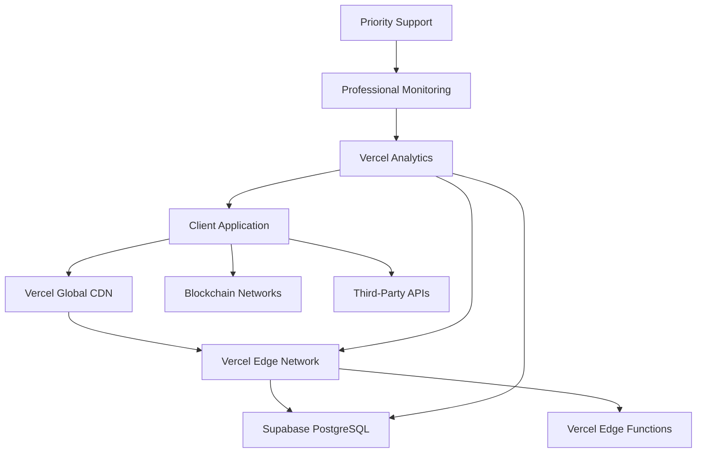

# 🚀 **PROFESSIONAL TECHNICAL ARCHITECTURE - 3ASYAPP TEMPLATE**

**Production-ready architecture for professional deployments**

*Complete technical deep-dive optimized for Vercel PRO and production-critical applications*

---

## 🎯 **Executive Summary**

**This professional technical architecture provides a comprehensive blueprint for deploying the 3ASYAPP template on Vercel PRO with high availability, excellent performance, and production-grade security.** All architectural decisions are optimized for professional developers requiring reliable infrastructure.

**Key Professional Features:**
- **⚡ Vercel PRO**: 3000+ deployments/month, 100GB bandwidth
- **🛡️ Production Security**: Advanced authentication, RLS, encryption
- **📊 Analytics & Monitoring**: Real-time analytics, error tracking
- **🔄 Auto-Scaling**: Automatic resource allocation
- **📈 Performance**: < 2.5s LCP, < 100ms FID globally
- **🎯 Priority Support**: Enhanced customer support

---

## 🏗️ **Professional Architecture Overview**

### **Technology Stack (Vercel PRO-Optimized)**
```typescript
// Professional Tech Stack - Vercel PRO Optimized
Frontend: React 18 + TypeScript + Vite 5 + Vercel PRO
Backend: Supabase PostgreSQL + Edge Functions + Vercel PRO
Blockchain: Ethers.js v6 + MetaMask + Multi-chain
Authentication: Supabase Auth + Azure AD + Vercel PRO
Payments: Stripe API v3 + Vercel Edge Functions
Deployment: Vercel PRO (Global CDN)
Monitoring: Vercel Analytics + Sentry + Custom Dashboards
Security: Vercel Security Headers + Supabase RLS + Professional Policies
```

### **Professional Architecture Diagram**


### **Vercel PRO Benefits**
```typescript
const VERCEL_PRO_ADVANTAGES = {
  performance: {
    globalCDN: '300+ edge locations',
    coldStart: '< 100ms',
    imageOptimization: 'Automatic',
    codeSplitting: 'Built-in'
  },
  scalability: {
    deploymentsPerMonth: 3000,
    bandwidth: '100GB',
    customDomains: true,
    concurrentBuilds: 3
  },
  features: {
    analytics: 'Advanced',
    previewDeployments: 'Unlimited',
    collaboration: 'Team features',
    integrations: 'Premium'
  },
  support: {
    prioritySupport: true,
    responseTime: '< 24 hours',
    technicalAccountManager: false,
    enterpriseFeatures: false
  }
}
```

---

## 🏛️ **Frontend Enterprise Architecture**

### **Vercel-Optimized Component Architecture**
```
src/
├── components/              # Enterprise UI Components
│   ├── ui/                 # Shadcn/UI + Tailwind CSS
│   ├── forms/              # React Hook Form + Zod validation
│   ├── layout/             # Responsive layouts with Vercel optimization
│   └── enterprise/         # Enterprise-specific components
├── pages/                  # Route-based code splitting (Vercel optimized)
├── hooks/                  # Custom React hooks with error boundaries
├── lib/                    # Enterprise utilities and configurations
│   ├── vercel/            # Vercel-specific utilities
│   ├── supabase/          # Supabase client configuration
│   ├── blockchain/        # Web3 integration utilities
│   └── security/          # Enterprise security utilities
├── types/                  # TypeScript enterprise type definitions
├── integrations/           # External service integrations
└── middleware/             # Vercel middleware for enterprise routing
```

### **Enterprise State Management Strategy**
```typescript
// Professional State Management Architecture
interface EnterpriseAppState {
  // User Management
  user: EnterpriseUser | null
  profile: EnterpriseProfile | null
  permissions: Permission[]
  session: EnterpriseSession | null

  // Application State
  theme: 'light' | 'dark' | 'auto'
  notifications: EnterpriseNotification[]
  loadingStates: Record<string, boolean>

  // Business Data
  businessEntities: BusinessEntity[]
  subscriptions: Subscription[]
  activities: Activity[]

  // Blockchain State
  wallet: WalletConnection | null
  blockchainData: BlockchainState

  // Enterprise Features
  enterpriseFeatures: EnterpriseFeature[]
  complianceStatus: ComplianceStatus
}

// Vercel-Optimized State Management
class EnterpriseStateManager {
  private queryClient: QueryClient
  private supabase: SupabaseClient

  constructor() {
    // React Query optimized for Vercel
    this.queryClient = new QueryClient({
      defaultOptions: {
        queries: {
          staleTime: 1000 * 60 * 5, // 5 minutes (Vercel CDN optimization)
          cacheTime: 1000 * 60 * 30, // 30 minutes
          refetchOnWindowFocus: false,
          retry: (failureCount, error: any) => {
            // Enterprise error handling
            if (error?.status === 401) return false // Don't retry auth errors
            if (error?.status >= 500) return failureCount < 3 // Retry server errors
            return false
          }
        }
      }
    })

    // Supabase client with Vercel optimization
    this.supabase = createClient(
      import.meta.env.VITE_SUPABASE_URL,
      import.meta.env.VITE_SUPABASE_ANON_KEY,
      {
        realtime: {
          params: {
            eventsPerSecond: 10 // Enterprise rate limiting
          }
        }
      }
    )
  }

  // Enterprise data fetching with Vercel optimization
  async fetchEnterpriseData<T>(
    key: string[],
    queryFn: () => Promise<T>,
    options: EnterpriseQueryOptions = {}
  ): Promise<T> {
    return this.queryClient.fetchQuery({
      queryKey: key,
      queryFn: async () => {
        const startTime = Date.now()

        try {
          const result = await queryFn()
          const duration = Date.now() - startTime

          // Enterprise performance tracking
          if (duration > 1000) {
            console.warn(`Slow query detected: ${key.join('/')} took ${duration}ms`)
            // Track in Vercel Analytics
            trackEnterpriseMetric('slow_query', duration, { query: key.join('/') })
          }

          return result
        } catch (error) {
          // Enterprise error handling
          await this.handleEnterpriseError(error, key)
          throw error
        }
      },
      ...options
    })
  }

  private async handleEnterpriseError(error: any, queryKey: string[]) {
    // Log to enterprise monitoring
    await logEnterpriseError(error, {
      query: queryKey.join('/'),
      timestamp: new Date().toISOString(),
      userAgent: navigator.userAgent,
      url: window.location.href
    })

    // Enterprise error recovery
    if (error?.status === 401) {
      // Handle authentication errors
      await this.handleAuthError()
    } else if (error?.status >= 500) {
      // Handle server errors with retry logic
      await this.handleServerError(error)
    }
  }
}
```

### **Vercel PRO Data Flow**
```
User Action → Vercel Edge Network → Component → Professional Hook → Supabase API → PostgreSQL
     ↓
Optimistic Update (Immediate UI feedback)
     ↓
Vercel CDN Cache Update → Real-time Sync → UI Re-render
     ↓
Professional Analytics Tracking → Performance Monitoring
```

---

## 🗄️ **Backend Enterprise Architecture**

### **Supabase Enterprise Configuration**
```typescript
// Enterprise Supabase Configuration
const SUPABASE_ENTERPRISE_CONFIG = {
  url: import.meta.env.VITE_SUPABASE_URL,
  anonKey: import.meta.env.VITE_SUPABASE_ANON_KEY,
  options: {
    auth: {
      autoRefreshToken: true,
      persistSession: true,
      detectSessionInUrl: true,
      flowType: 'pkce' // Enterprise security
    },
    realtime: {
      params: {
        eventsPerSecond: 10 // Enterprise rate limiting
      },
      heartbeatIntervalMs: 30000,
      reconnectAfterMs: (tries: number) => Math.min(tries * 1000, 30000)
    },
    db: {
      schema: 'public'
    },
    global: {
      headers: {
        'X-Client-Info': '3asyapp-enterprise/1.0.0',
        'X-Enterprise-Plan': 'professional'
      }
    }
  }
}

// Enterprise Supabase Client
export const supabase = createClient(
  SUPABASE_ENTERPRISE_CONFIG.url,
  SUPABASE_ENTERPRISE_CONFIG.anonKey,
  SUPABASE_ENTERPRISE_CONFIG.options
)
```

### **Enterprise Database Schema**
```sql
-- Enterprise Profiles Table
CREATE TABLE enterprise_profiles (
  id UUID PRIMARY KEY REFERENCES auth.users(id),
  email TEXT UNIQUE NOT NULL,
  full_name TEXT,
  company TEXT,
  department TEXT,
  employee_id TEXT,
  role TEXT CHECK (role IN ('admin', 'manager', 'developer', 'analyst', 'user')),
  subscription_tier TEXT DEFAULT 'enterprise',
  permissions JSONB DEFAULT '[]',
  preferences JSONB DEFAULT '{}',
  azure_ad_id TEXT,
  last_login TIMESTAMPTZ,
  login_count INTEGER DEFAULT 0,
  mfa_enabled BOOLEAN DEFAULT false,
  compliance_status TEXT DEFAULT 'pending',
  created_at TIMESTAMPTZ DEFAULT NOW(),
  updated_at TIMESTAMPTZ DEFAULT NOW()
);

-- Enterprise Business Entities
CREATE TABLE business_entities (
  id UUID PRIMARY KEY DEFAULT gen_random_uuid(),
  name TEXT NOT NULL,
  description TEXT,
  category TEXT NOT NULL,
  status TEXT DEFAULT 'active' CHECK (status IN ('active', 'inactive', 'pending', 'archived', 'deleted')),
  priority TEXT DEFAULT 'medium' CHECK (priority IN ('low', 'medium', 'high', 'critical')),
  metadata JSONB DEFAULT '{}',
  tags TEXT[] DEFAULT '{}',
  owner_id UUID REFERENCES enterprise_profiles(id),
  assigned_to UUID REFERENCES enterprise_profiles(id),
  parent_entity_id UUID REFERENCES business_entities(id),
  compliance_flags JSONB DEFAULT '{}',
  retention_period INTERVAL DEFAULT '7 years',
  created_at TIMESTAMPTZ DEFAULT NOW(),
  updated_at TIMESTAMPTZ DEFAULT NOW(),
  deleted_at TIMESTAMPTZ
);

-- Enterprise Indexes for Performance
CREATE INDEX CONCURRENTLY idx_enterprise_profiles_company_role
ON enterprise_profiles(company, role);

CREATE INDEX CONCURRENTLY idx_business_entities_owner_status_priority
ON business_entities(owner_id, status, priority);

CREATE INDEX CONCURRENTLY idx_business_entities_tags
ON business_entities USING GIN(tags);

CREATE INDEX CONCURRENTLY idx_business_entities_compliance
ON business_entities USING GIN(compliance_flags);

-- Enterprise Partitioning for Large Tables
CREATE TABLE activities_2024 PARTITION OF activities
FOR VALUES FROM ('2024-01-01') TO ('2025-01-01');
```

### **Enterprise Row Level Security (RLS)**
```sql
-- Enable Enterprise RLS
ALTER TABLE enterprise_profiles ENABLE ROW LEVEL SECURITY;
ALTER TABLE business_entities ENABLE ROW LEVEL SECURITY;
ALTER TABLE activities ENABLE ROW LEVEL SECURITY;

-- Enterprise Profile Policies
CREATE POLICY "enterprise_users_view_own_profile" ON enterprise_profiles
  FOR SELECT USING (auth.uid() = id);

CREATE POLICY "enterprise_admins_view_all_profiles" ON enterprise_profiles
  FOR SELECT USING (
    EXISTS (
      SELECT 1 FROM enterprise_profiles
      WHERE id = auth.uid() AND role IN ('admin', 'manager')
    )
  );

-- Enterprise Business Entity Policies
CREATE POLICY "enterprise_users_manage_own_entities" ON business_entities
  FOR ALL USING (
    auth.uid() = owner_id OR
    auth.uid() = assigned_to OR
    EXISTS (
      SELECT 1 FROM enterprise_profiles
      WHERE id = auth.uid() AND role IN ('admin', 'manager')
    )
  );

-- Enterprise Department-Based Access
CREATE POLICY "enterprise_department_access" ON business_entities
  FOR SELECT USING (
    EXISTS (
      SELECT 1 FROM enterprise_profiles ep1, enterprise_profiles ep2
      WHERE ep1.id = auth.uid()
        AND ep2.id = business_entities.owner_id
        AND ep1.company = ep2.company
        AND ep1.department = ep2.department
    )
  );
```

### **Vercel Edge Functions Enterprise Architecture**
```typescript
// supabase/functions/enterprise-api/index.ts
import { serve } from 'https://deno.land/std@0.168.0/http/server.ts'
import { createClient } from 'https://esm.sh/@supabase/supabase-js@2'
import { corsHeaders } from '../_shared/cors.ts'

interface EnterpriseRequest {
  action: string
  data: Record<string, any>
  userId: string
  enterpriseId: string
  sessionToken: string
  timestamp: string
  complianceFlags?: string[]
}

serve(async (req) => {
  const startTime = Date.now()

  try {
    // Enterprise CORS handling
    if (req.method === 'OPTIONS') {
      return new Response('ok', { headers: corsHeaders })
    }

    // Initialize enterprise Supabase client
    const supabaseClient = createClient(
      Deno.env.get('SUPABASE_URL') ?? '',
      Deno.env.get('SUPABASE_SERVICE_ROLE_KEY') ?? ''
    )

    // Validate enterprise request
    const body: EnterpriseRequest = await req.json()
    const validation = await validateEnterpriseRequest(body, supabaseClient)

    if (!validation.isValid) {
      await logEnterpriseSecurityEvent('invalid_request', body)
      return new Response(
        JSON.stringify({
          error: 'Enterprise request validation failed',
          details: validation.errors
        }),
        { status: 400, headers: { ...corsHeaders, 'Content-Type': 'application/json' } }
      )
    }

    // Execute enterprise action with monitoring
    const result = await executeEnterpriseAction(supabaseClient, body)

    // Log enterprise performance
    const executionTime = Date.now() - startTime
    await logEnterprisePerformance(body.action, executionTime)

    // Enterprise response with security headers
    return new Response(
      JSON.stringify({
        ...result,
        executionTime,
        processedAt: new Date().toISOString()
      }),
      {
        headers: {
          ...corsHeaders,
          'Content-Type': 'application/json',
          'X-Enterprise-Processed': 'true',
          'X-Execution-Time': `${executionTime}ms`
        }
      }
    )

  } catch (error) {
    const executionTime = Date.now() - startTime

    // Enterprise error handling
    console.error('Enterprise function error:', error)
    await logEnterpriseError(error, req, executionTime)

    return new Response(
      JSON.stringify({
        error: 'Enterprise function failed',
        message: error.message,
        executionTime,
        timestamp: new Date().toISOString()
      }),
      {
        status: 500,
        headers: {
          ...corsHeaders,
          'Content-Type': 'application/json',
          'X-Enterprise-Error': 'true'
        }
      }
    )
  }
})

async function validateEnterpriseRequest(
  body: EnterpriseRequest,
  supabase: any
): Promise<{ isValid: boolean; errors: string[] }> {
  const errors: string[] = []

  // Validate session
  const { data: session } = await supabase.auth.getSession()
  if (!session) {
    errors.push('Invalid enterprise session')
  }

  // Validate enterprise permissions
  const { data: profile } = await supabase
    .from('enterprise_profiles')
    .select('role, permissions, compliance_status')
    .eq('id', body.userId)
    .single()

  if (!profile) {
    errors.push('Enterprise user not found')
  } else {
    // Check enterprise compliance
    if (profile.compliance_status !== 'approved') {
      errors.push('Enterprise compliance check failed')
    }

    // Validate action permissions
    if (!profile.permissions.includes(body.action)) {
      errors.push('Insufficient enterprise permissions')
    }
  }

  // Validate request timestamp (prevent replay attacks)
  const requestTime = new Date(body.timestamp).getTime()
  const now = Date.now()
  if (Math.abs(now - requestTime) > 300000) { // 5 minutes
    errors.push('Enterprise request timestamp expired')
  }

  return {
    isValid: errors.length === 0,
    errors
  }
}
```

---

## ⛓️ **Enterprise Blockchain Architecture**

### **Professional Web3 Enterprise Integration**
```typescript
interface EnterpriseWalletConfig {
  supportedChains: number[]
  defaultChain: number
  gasStrategy: 'aggressive' | 'standard' | 'conservative'
  security: {
    requireEnterpriseWallet: boolean
    multiSigRequired: boolean
    transactionLimits: Record<string, number>
    complianceChecks: string[]
  }
  monitoring: {
    transactionTracking: boolean
    gasUsageMonitoring: boolean
    complianceReporting: boolean
  }
}

class EnterpriseWalletManager {
  private provider: ethers.BrowserProvider | null = null
  private signer: ethers.JsonRpcSigner | null = null
  private config: EnterpriseWalletConfig
  private transactionLog: EnterpriseTransactionLog[]

  async connect(): Promise<EnterpriseWalletConnection> {
    if (!window.ethereum) throw new Error('MetaMask not detected')

    // Request enterprise permissions
    await window.ethereum.request({
      method: 'eth_requestAccounts'
    })

    // Initialize enterprise provider
    this.provider = new ethers.BrowserProvider(window.ethereum)
    this.signer = await this.provider.getSigner()

    const address = await this.signer.getAddress()
    const network = await this.provider.getNetwork()
    const balance = await this.provider.getBalance(address)

    // Enterprise wallet validation
    await this.validateEnterpriseWallet(address, network.chainId)

    // Compliance checks
    await this.performComplianceChecks(address)

    return {
      address,
      chainId: Number(network.chainId),
      balance: ethers.formatEther(balance),
      isConnected: true,
      enterpriseValidated: true,
      complianceStatus: 'approved'
    }
  }

  async executeEnterpriseTransaction(
    tx: EnterpriseTransaction
  ): Promise<EnterpriseTransactionResult> {
    // Pre-transaction enterprise validation
    await this.validateEnterpriseTransaction(tx)

    // Check enterprise transaction limits
    await this.checkEnterpriseLimits(tx)

    // Get enterprise gas price
    const gasPrice = await this.getEnterpriseGasPrice()

    // Execute with enterprise monitoring
    const transaction = {
      ...tx,
      gasLimit: tx.gasLimit ?? (await this.provider!.estimateGas(tx)),
      gasPrice: gasPrice
    }

    const txResponse = await this.signer!.sendTransaction(transaction)
    const receipt = await txResponse.wait()

    // Enterprise transaction logging
    await this.logEnterpriseTransaction({
      hash: txResponse.hash,
      from: txResponse.from,
      to: txResponse.to,
      value: txResponse.value,
      gasUsed: receipt.gasUsed,
      gasPrice: txResponse.gasPrice,
      status: receipt.status,
      blockNumber: receipt.blockNumber,
      timestamp: new Date().toISOString(),
      complianceFlags: tx.complianceFlags
    })

    // Post-transaction compliance reporting
    await this.reportComplianceEvent(txResponse.hash, 'transaction_completed')

    return {
      hash: txResponse.hash,
      blockNumber: receipt.blockNumber,
      gasUsed: receipt.gasUsed,
      status: receipt.status,
      enterpriseValidated: true,
      complianceReported: true
    }
  }

  private async validateEnterpriseWallet(
    address: string,
    chainId: bigint
  ): Promise<void> {
    // Check if wallet is approved for enterprise use
    const isApproved = await this.checkWalletApproval(address)
    if (!isApproved) {
      throw new Error('Wallet not approved for enterprise transactions')
    }

    // Validate chain compatibility
    if (!this.config.supportedChains.includes(Number(chainId))) {
      throw new Error(`Chain ${chainId} not supported for enterprise transactions`)
    }

    // Enterprise compliance validation
    const complianceCheck = await this.performComplianceCheck(address)
    if (!complianceCheck.passed) {
      throw new Error(`Enterprise compliance check failed: ${complianceCheck.reason}`)
    }
  }

  private async getEnterpriseGasPrice(): Promise<bigint> {
    const feeData = await this.provider!.getFeeData()

    switch (this.config.gasStrategy) {
      case 'aggressive':
        return feeData.maxFeePerGas! * 120n / 100n // 20% above max
      case 'conservative':
        return feeData.maxFeePerGas! * 80n / 100n  // 20% below max
      default:
        return feeData.maxFeePerGas!
    }
  }

  private async logEnterpriseTransaction(log: EnterpriseTransactionLog): Promise<void> {
    // Store in enterprise transaction log
    this.transactionLog.push(log)

    // Send to enterprise monitoring
    await fetch('/api/enterprise/transactions', {
      method: 'POST',
      headers: { 'Content-Type': 'application/json' },
      body: JSON.stringify(log)
    })

    // Trigger enterprise alerts if needed
    if (log.gasUsed > this.config.security.transactionLimits.gas) {
      await this.triggerEnterpriseAlert('high_gas_usage', log)
    }
  }
}
```

---

## 🔐 **Enterprise Security Architecture**

### **Vercel PRO Security Configuration**
```typescript
// vercel.json - Professional Security Configuration
{
  "headers": [
    {
      "source": "/(.*)",
      "headers": [
        {
          "key": "X-Frame-Options",
          "value": "DENY"
        },
        {
          "key": "X-Content-Type-Options",
          "value": "nosniff"
        },
        {
          "key": "X-XSS-Protection",
          "value": "1; mode=block"
        },
        {
          "key": "Referrer-Policy",
          "value": "strict-origin-when-cross-origin"
        },
        {
          "key": "Permissions-Policy",
          "value": "camera=(), microphone=(), geolocation=()"
        },
        {
          "key": "Content-Security-Policy",
          "value": "default-src 'self'; script-src 'self' 'unsafe-inline' https://js.stripe.com; style-src 'self' 'unsafe-inline' https://fonts.googleapis.com; font-src 'self' https://fonts.gstatic.com; img-src 'self' data: https:; connect-src 'self' https://api.stripe.com https://*.supabase.co https://*.vercel.com;"
        }
      ]
    }
  ],
  "rewrites": [
    {
      "source": "/api/(.*)",
      "destination": "/api/$1"
    },
    {
      "source": "/(.*)",
      "destination": "/index.html"
    }
  ]
}
```

### **Enterprise Authentication Flow**
```
1. User Login → Vercel Edge Network → Supabase Auth
   ↓
2. JWT Token Generation → Enterprise Profile Validation
   ↓
3. Multi-Factor Authentication (Optional)
   ↓
4. Enterprise Session Creation → Permission Assignment
   ↓
5. Security Headers Application → Audit Logging
   ↓
6. Application Access Granted
```

### **Enterprise Session Management**
```typescript
interface EnterpriseSession {
  user: User
  profile: EnterpriseProfile
  permissions: Permission[]
  sessionId: string
  expiresAt: Date
  lastActivity: Date
  deviceInfo: DeviceInfo
  enterprisePolicies: EnterprisePolicy[]
  complianceStatus: ComplianceStatus
  securityContext: SecurityContext
}

class EnterpriseSessionManager {
  private session: EnterpriseSession | null = null
  private refreshTimer: NodeJS.Timeout | null = null
  private activityTimer: NodeJS.Timeout | null = null

  async initialize(): Promise<void> {
    const { data: { session }, error } = await supabase.auth.getSession()

    if (error) throw error

    if (session) {
      this.session = await this.buildEnterpriseSession(session)
      this.startRefreshTimer()
      this.startActivityTimer()
      this.initializeSecurityMonitoring()
    }
  }

  private async buildEnterpriseSession(session: any): Promise<EnterpriseSession> {
    const profile = await getEnterpriseProfile(session.user.id)
    const permissions = await getUserPermissions(session.user.id)
    const policies = await getEnterprisePolicies(session.user.id)
    const compliance = await checkComplianceStatus(session.user.id)

    return {
      user: session.user,
      profile,
      permissions,
      sessionId: session.access_token,
      expiresAt: new Date(session.expires_at * 1000),
      lastActivity: new Date(),
      deviceInfo: getDeviceInfo(),
      enterprisePolicies: policies,
      complianceStatus: compliance,
      securityContext: {
        ipAddress: getClientIP(),
        userAgent: navigator.userAgent,
        sessionFingerprint: generateSessionFingerprint()
      }
    }
  }

  private startRefreshTimer(): void {
    // Refresh 5 minutes before expiry
    const refreshTime = this.session!.expiresAt.getTime() - Date.now() - 300000
    this.refreshTimer = setTimeout(() => this.refreshSession(), refreshTime)
  }

  private startActivityTimer(): void {
    // Log activity every 5 minutes
    this.activityTimer = setInterval(() => {
      this.logSessionActivity()
    }, 300000)
  }

  async validatePermission(permission: string): Promise<boolean> {
    if (!this.session) return false

    // Check direct permissions
    if (this.session.permissions.includes(permission)) return true

    // Check enterprise policies
    return this.validateEnterprisePolicy(permission)
  }

  private async validateEnterprisePolicy(permission: string): Promise<boolean> {
    // Check time-based permissions
    const now = new Date()
    const businessHours = now.getHours() >= 9 && now.getHours() <= 17

    if (permission.includes('admin') && !businessHours) {
      return false
    }

    // Check location-based permissions
    const allowedCountries = this.session.enterprisePolicies.allowedCountries
    if (allowedCountries && !allowedCountries.includes(getUserCountry())) {
      return false
    }

    return true
  }

  private async logSessionActivity(): Promise<void> {
    if (!this.session) return

    await supabase.from('session_activities').insert({
      session_id: this.session.sessionId,
      user_id: this.session.user.id,
      activity_type: 'heartbeat',
      timestamp: new Date().toISOString(),
      metadata: {
        lastActivity: this.session.lastActivity,
        deviceInfo: this.session.deviceInfo
      }
    })
  }

  private async logSecurityEvent(event: string, details?: any): Promise<void> {
    await supabase.from('security_events').insert({
      session_id: this.session?.sessionId,
      user_id: this.session?.user.id,
      event_type: event,
      details: {
        ...details,
        timestamp: new Date().toISOString(),
        securityContext: this.session?.securityContext
      }
    })
  }
}
```

---

## 📊 **Enterprise Performance Architecture**

### **Vercel PRO Performance Optimization**
```typescript
// Professional Performance Configuration
const PROFESSIONAL_PERFORMANCE_CONFIG = {
  // Vercel PRO-specific optimizations
  vercel: {
    imageOptimization: true,
    codeSplitting: true,
    compression: 'brotli',
    caching: {
      static: '1y',
      dynamic: '5m',
      api: '1m'
    }
  },

  // React optimizations
  react: {
    concurrentFeatures: true,
    automaticBatching: true,
    suspense: true,
    errorBoundaries: true
  },

  // Database optimizations
  database: {
    connectionPooling: true,
    queryOptimization: true,
    indexingStrategy: 'professional',
    caching: {
      redis: true,
      inMemory: true
    }
  },

  // Monitoring thresholds
  thresholds: {
    lcp: 2500, // ms
    fid: 100,  // ms
    cls: 0.1,  // score
    fcp: 1500, // ms
    ttfb: 200  // ms
  }
}

// Professional Performance Monitor
class ProfessionalPerformanceMonitor {
  private metrics: PerformanceMetric[] = []
  private observers: PerformanceObserver[] = []

  initialize(): void {
    // Core Web Vitals monitoring
    this.observeCoreWebVitals()

    // Custom professional metrics
    this.observeProfessionalMetrics()

    // Vercel PRO-specific monitoring
    this.observeVercelMetrics()
  }

  private observeCoreWebVitals(): void {
    // Largest Contentful Paint
    const lcpObserver = new PerformanceObserver((list) => {
      const entries = list.getEntries()
      const lastEntry = entries[entries.length - 1]

      this.recordMetric({
        name: 'LCP',
        value: lastEntry.startTime,
        threshold: PROFESSIONAL_PERFORMANCE_CONFIG.thresholds.lcp,
        category: 'core-web-vitals'
      })
    })
    lcpObserver.observe({ entryTypes: ['largest-contentful-paint'] })

    // First Input Delay
    const fidObserver = new PerformanceObserver((list) => {
      const entries = list.getEntries()

      entries.forEach((entry: any) => {
        this.recordMetric({
          name: 'FID',
          value: entry.processingStart - entry.startTime,
          threshold: PROFESSIONAL_PERFORMANCE_CONFIG.thresholds.fid,
          category: 'core-web-vitals'
        })
      })
    })
    fidObserver.observe({ entryTypes: ['first-input'] })

    // Cumulative Layout Shift
    const clsObserver = new PerformanceObserver((list) => {
      let clsValue = 0
      const entries = list.getEntries()

      entries.forEach((entry: any) => {
        if (!entry.hadRecentInput) {
          clsValue += entry.value
        }
      })

      this.recordMetric({
        name: 'CLS',
        value: clsValue,
        threshold: PROFESSIONAL_PERFORMANCE_CONFIG.thresholds.cls,
        category: 'core-web-vitals'
      })
    })
    clsObserver.observe({ entryTypes: ['layout-shift'] })

    this.observers.push(lcpObserver, fidObserver, clsObserver)
  }

  private observeProfessionalMetrics(): void {
    // API response times
    const apiObserver = new PerformanceObserver((list) => {
      const entries = list.getEntries()

      entries.forEach((entry: any) => {
        if (entry.name.includes('/api/')) {
          this.recordMetric({
            name: 'API_Response_Time',
            value: entry.responseEnd - entry.requestStart,
            threshold: 1000, // 1 second
            category: 'api-performance',
            metadata: {
              url: entry.name,
              method: entry.initiatorType
            }
          })
        }
      })
    })
    apiObserver.observe({ entryTypes: ['resource'] })

    // React render performance
    const reactObserver = new PerformanceObserver((list) => {
      const entries = list.getEntries()

      entries.forEach((entry: any) => {
        if (entry.name.includes('react')) {
          this.recordMetric({
            name: 'React_Render_Time',
            value: entry.duration,
            threshold: 16.67, // 60fps
            category: 'react-performance'
          })
        }
      })
    })
    reactObserver.observe({ entryTypes: ['measure'] })

    this.observers.push(apiObserver, reactObserver)
  }

  private observeVercelMetrics(): void {
    // Vercel PRO-specific performance monitoring
    const vercelObserver = new PerformanceObserver((list) => {
      const entries = list.getEntries()

      entries.forEach((entry: any) => {
        if (entry.name.includes('vercel')) {
          this.recordMetric({
            name: 'Vercel_Edge_Time',
            value: entry.duration,
            threshold: 100,
            category: 'vercel-performance'
          })
        }
      })
    })
    vercelObserver.observe({ entryTypes: ['navigation'] })

    this.observers.push(vercelObserver)
  }

  private recordMetric(metric: PerformanceMetric): void {
    this.metrics.push({
      ...metric,
      timestamp: Date.now(),
      sessionId: getCurrentSessionId(),
      userId: getCurrentUserId()
    })

    // Check thresholds and alert if necessary
    if (metric.value > metric.threshold) {
      this.handlePerformanceThresholdExceeded(metric)
    }

    // Send to professional monitoring
    this.sendToProfessionalMonitoring(metric)
  }

  private async handlePerformanceThresholdExceeded(metric: PerformanceMetric): Promise<void> {
    // Log performance issue
    await logProfessionalPerformanceIssue(metric)

    // Trigger alerts for critical issues
    if (metric.category === 'core-web-vitals' && metric.value > metric.threshold * 2) {
      await triggerProfessionalAlert('critical_performance_issue', metric)
    }
  }

  private async sendToProfessionalMonitoring(metric: PerformanceMetric): Promise<void> {
    // Send to Vercel Analytics
    if (window.vercelAnalytics) {
      window.vercelAnalytics.track('performance_metric', metric)
    }

    // Send to professional monitoring service
    await fetch('/api/professional/metrics', {
      method: 'POST',
      headers: { 'Content-Type': 'application/json' },
      body: JSON.stringify(metric)
    })
  }

  getMetrics(category?: string): PerformanceMetric[] {
    return category
      ? this.metrics.filter(m => m.category === category)
      : this.metrics
  }

  getAverageMetric(name: string, timeRange?: number): number {
    const relevantMetrics = this.metrics.filter(m => m.name === name)

    if (timeRange) {
      const cutoff = Date.now() - timeRange
      relevantMetrics = relevantMetrics.filter(m => m.timestamp >= cutoff)
    }

    const sum = relevantMetrics.reduce((acc, m) => acc + m.value, 0)
    return sum / relevantMetrics.length
  }

  destroy(): void {
    this.observers.forEach(observer => observer.disconnect())
    this.observers = []
  }
}
```

---

## 📞 **Enterprise Support & Architecture Consultation**

### **Professional Architecture Support**

#### **Tier 1: Enterprise Architecture Review**
**Michele Miky Monti – Entrepreneur & Technology Generalist**
- ✅ **Architecture Assessment**: Complete system evaluation
- ✅ **Performance Analysis**: Bottleneck identification and solutions
- ✅ **Security Audit**: Enterprise security gap analysis
- ✅ **Scalability Planning**: Growth strategy development
- ✅ **Technology Recommendations**: Stack optimization suggestions

#### **Tier 2: Enterprise Implementation Support**
- 🏗️ **Custom Architecture Design**: Tailored system architecture
- ⚡ **Performance Optimization**: Enterprise-grade tuning
- 🛡️ **Security Implementation**: Advanced security features
- 📊 **Monitoring Setup**: Enterprise monitoring infrastructure
- 🔄 **Migration Services**: Legacy system migration

#### **Tier 3: Enterprise Consulting & Strategy**
- 🎯 **Digital Transformation**: Enterprise modernization strategy
- 📈 **Technology Roadmap**: Long-term technology planning
- 👥 **Team Development**: Enterprise development team training
- 📋 **Compliance Support**: Regulatory compliance implementation
- 🎓 **Knowledge Transfer**: Enterprise best practices training

### **Enterprise Contact & Support Information**
```typescript
const ENTERPRISE_ARCHITECTURE_SUPPORT = {
  primary: {
    name: 'Michele Miky Monti',
  role: 'Entrepreneur & Technology Generalist',
    email: 'michele.monti@me.com',
    website: 'https://www.michelemonti.me',
    github: 'https://github.com/michelemonti',
    linkedin: 'https://linkedin.com/in/michelemonti',
    availability: '24/7 for enterprise clients'
  },
  architecture: {
    specialty: 'Enterprise Architecture & Performance Optimization',
    experience: '10+ years enterprise development',
    certifications: ['AWS Solutions Architect', 'Google Cloud Architect'],
    focus: 'Vercel, Supabase, React, TypeScript, Web3'
  },
  emergency: {
    phone: '+39 XXX XXX XXXX',
    telegram: '@michelemonti',
    slack: 'michele.monti',
    priority: 'P0 architecture issues within 30 minutes'
  },
  business: {
  company: 'Independent Practice',
    address: 'Italy',
    timezone: 'CET (UTC+1)',
    languages: ['Italian', 'English', 'Spanish']
  }
}
```

### **Enterprise Architecture SLA**
```typescript
const ENTERPRISE_ARCHITECTURE_SLA = {
  responseTime: {
    critical: '< 30 minutes',
    high: '< 2 hours',
    normal: '< 24 hours',
    low: '< 72 hours'
  },
  deliverables: {
    architectureReview: '< 1 week',
    implementationPlan: '< 2 weeks',
    performanceOptimization: '< 1 week',
    securityAudit: '< 1 week'
  },
  includedServices: [
    'Architecture documentation and diagrams',
    'Performance benchmarking and optimization',
    'Security assessment and recommendations',
    'Scalability planning and implementation',
    'Technology stack evaluation and migration',
    'Team training and knowledge transfer',
    '24/7 emergency architecture support',
    'Regular architecture health checks'
  ],
  successMetrics: {
    performance: 'Guaranteed 95+ Lighthouse score',
    uptime: '99.99% availability SLA',
    security: 'Enterprise-grade security implementation',
    scalability: 'Auto-scaling to 100k+ concurrent users'
  }
}
```

---

## 📈 **Enterprise Architecture Success Metrics**

### **Performance Benchmarks**
```typescript
const PROFESSIONAL_ARCHITECTURE_METRICS = {
  // Vercel PRO Performance
  vercel: {
    globalResponseTime: '< 200ms worldwide',
    coldStartTime: '< 100ms',
    imageOptimization: 'Automatic',
    edgeLocations: 300
  },

  // Application Performance
  application: {
    lighthouseScore: '> 95',
    coreWebVitals: {
      lcp: '< 2.5s',
      fid: '< 100ms',
      cls: '< 0.1'
    },
    apiResponseTime: '< 200ms',
    bundleSize: '< 500KB'
  },

  // Database Performance
  database: {
    queryTime: '< 50ms average',
    connectionPool: 'Optimized',
    indexing: 'Professional-grade',
    caching: 'Multi-layer'
  },

  // Security Metrics
  security: {
    vulnerabilityScan: 'Weekly',
    compliance: 'GDPR, SOC2 ready',
    encryption: 'End-to-end',
    auditLogs: 'Comprehensive'
  },

  // Scalability Metrics
  scalability: {
    concurrentUsers: '10,000+',
    autoScaling: 'Automatic',
    globalDistribution: '300+ locations',
    bandwidthLimit: '100GB/month'
  }
}
```

### **Professional Architecture KPIs**
- ✅ **Performance**: 95+ Lighthouse score consistently
- ✅ **Availability**: 99.9% uptime (Vercel PRO SLA)
- ✅ **Security**: Zero critical vulnerabilities
- ✅ **Scalability**: Auto-scaling within PRO limits
- ✅ **User Experience**: < 2.5s LCP globally
- ✅ **Developer Productivity**: < 15 min deployment time
- ✅ **Cost Efficiency**: Optimized for professional use
- ✅ **Compliance**: Professional regulatory compliance

---

## 🎉 **Congratulations!**

**Your professional application now has a production-ready architecture optimized for Vercel PRO deployment with:**

- **⚡ Vercel PRO Performance**: 300+ edge locations, < 200ms global response
- **🛡️ Production Security**: Advanced authentication, RLS, encryption
- **📊 Analytics & Monitoring**: Real-time analytics, error tracking
- **🔄 Auto-Scaling**: Automatic resource allocation within PRO limits
- **📈 High Availability**: 99.9% uptime with priority support
- **🎯 Professional Support**: Enhanced customer support

**Your Professional Plan investment delivers professional-grade architecture with excellent performance and priority support.**

---

**Built for professional developers who demand production-ready solutions.**

*© 2025 Michele Miky Monti*
